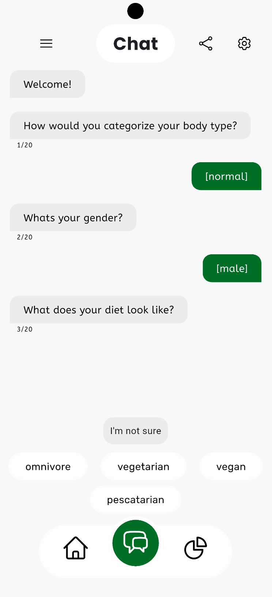
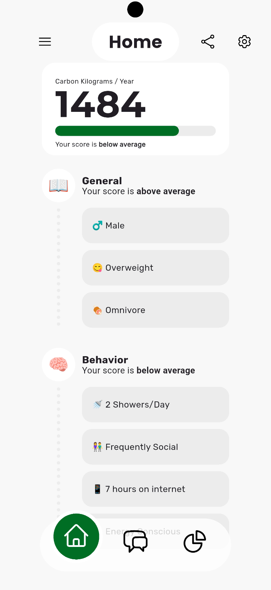
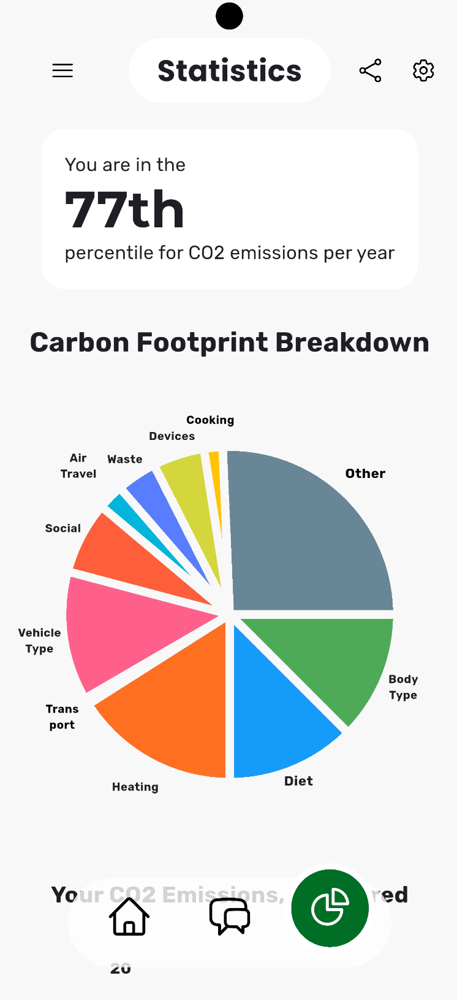
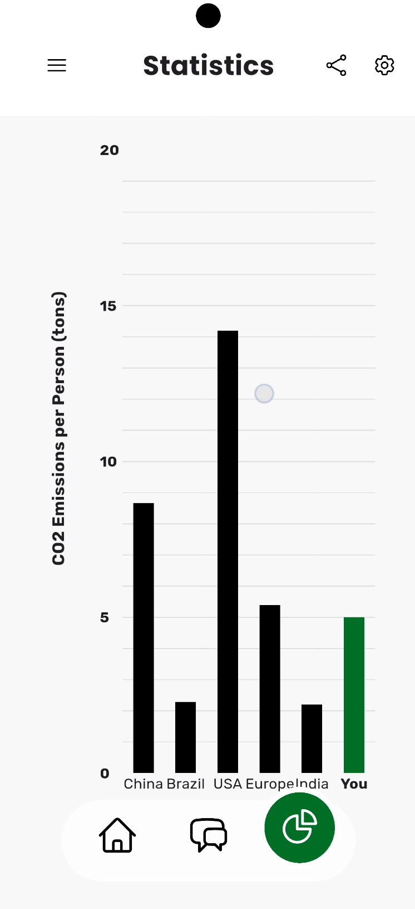

# MyCarbon

A Flutter mobile application that estimates a user's annual carbon footprint from their lifestyle and consumption habits.

MyCarbon was developed as a Grade 12 project by two students. The project combines a Flutter user interface with a machine-learning-powered backend API to turn a series of lifestyle questions into an estimated annual carbon footprint.

## Overview

MyCarbon guides users through a questionnaire covering areas such as diet, transportation, energy use, shopping, waste, technology usage, and travel.

The collected responses are sent to a custom prediction API, which uses a trained machine learning model to estimate the user's annual carbon emissions. The app then presents the result in an accessible format, including a comparison percentile.

### Project Architecture

```text
┌─────────────────────────────┐
│        MyCarbon App         │
│        Flutter / Dart       │
│                             │
│  • Questionnaire UI         │
│  • Navigation               │
│  • Data collection          │
│  • Results & visualisation  │
└──────────────┬──────────────┘
               │
               │ HTTP Request
               ▼
┌─────────────────────────────┐
│    MyCarbon Prediction API  │
│       Python / FastAPI      │
│                             │
│  • Receives 19 inputs       │
│  • Processes user data      │
│  • Runs ML model            │
│  • Returns prediction       │
└──────────────┬──────────────┘
               │
               ▼
       Carbon Footprint
       Prediction + Percentile
```

## Features

* Guided carbon-footprint questionnaire
* Lifestyle and consumption-based emissions estimation
* Machine-learning-based prediction
* Annual carbon-emissions result
* Percentile comparison
* Visual presentation of results
* Custom Flutter UI
* Cross-platform Flutter project structure

The prediction model takes 19 factors into account, including diet, transportation, vehicle type, energy source, grocery spending, air travel, waste production, technology usage, recycling, and cooking methods.

## Screenshots
Questionnaire | Home Page | Results (Pie Chart)                              | Results (Bar Graph)                              |
|---|-----------|--------------------------------------------------|--------------------------------------------------|
|  |  |  |


## Our Roles

This was a two-person project, with the application and machine-learning components developed separately and integrated together.

### Imran — UI / Frontend

I was primarily responsible for the **user interface and Flutter application**.

My work included:

* Designing and implementing the application's UI
* Building Flutter screens and reusable interface components
* Implementing navigation between questionnaire sections
* Collecting and structuring user responses
* Integrating the frontend with the prediction API
* Designing the presentation of the prediction results
* Working with SVG assets and custom typography
* Implementing data visualisations

The Flutter project uses `flutter_svg`, `google_fonts`, and `fl_chart` alongside Flutter's built-in UI framework.

### Kwabena — Machine Learning / Backend

Kwabena was primarily responsible for the **machine-learning model and prediction API**.

His work included:

* Preparing the carbon-emissions dataset
* Developing the machine-learning prediction model
* Creating the Python backend
* Building the FastAPI endpoint
* Connecting the trained model to the API
* Deploying the API to Render
* Testing the prediction system

The API accepts 19 lifestyle and consumption variables and returns a predicted emissions value, percentile, and model features.

## Technology Stack

### Mobile Application

* **Flutter/Dart**
* `flutter_svg`
* `google_fonts`
* `fl_chart`
* `cupertino_icons`

The repository includes Flutter targets for Android, iOS, Web, Windows, macOS, and Linux.

### Machine Learning API

* **Python**
* **FastAPI**
* **scikit-learn / TensorFlow**
* **Render**

The prediction API is deployed on Render and exposes a `/make-prediction/` endpoint.

## Prediction API

The application communicates with the separate [MyCarbon Prediction API](https://github.com/Kwabena-A/Carbon-Emissions-API).

### Endpoint

```text
GET /make-prediction/
```

The API receives the user's questionnaire responses and returns a result in the following structure:

```json
{
  "Features": [],
  "prediction": 0.0,
  "percentile": ""
}
```

The full API specification and example request are available in the API repository.

## Related Repository

**Machine Learning & API:**
[Carbon-Emissions-API](https://github.com/Kwabena-A/Carbon-Emissions-API)

The API repository contains the FastAPI application, trained model, dataset, and testing notebook.

## Running the App

### Prerequisites

* Flutter SDK
* Dart SDK
* Android Studio or another Flutter-compatible development environment
* A running instance of the MyCarbon Prediction API

### Installation

Clone the repository:

```bash
git clone https://github.com/Kwabena-A/MyCarbon-App.git
cd MyCarbon-App
```

Install dependencies:

```bash
flutter pub get
```

Run the application:

```bash
flutter run
```

For the prediction functionality to work, the application must be configured to communicate with the MyCarbon Prediction API.

## Running the API

The API is maintained in its own repository:

```bash
git clone https://github.com/Kwabena-A/Carbon-Emissions-API.git
cd Carbon-Emissions-API
```

Install the Python dependencies listed in `requirements.txt`, then run the FastAPI application using the project's configured entry point.

The API is also deployed through Render.

## Project Context

MyCarbon was developed as a **Grade 12 software project** with the goal of combining application development, data science, and environmental awareness.

The project gave us experience working across different parts of a software system: designing a user-facing application, communicating between a frontend and backend, deploying an API, and integrating a machine-learning model into a usable product.

## Contributors

* **Imran** — Flutter UI, frontend development, application integration
* **Kwabena** — Machine learning, backend development, prediction API

## License

No license has currently been specified for this project.
